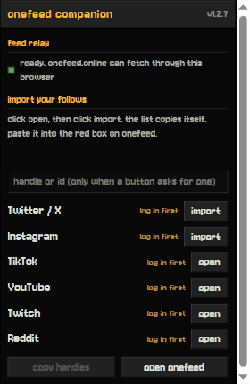

# OneFeed Companion



A small dependency free browser extension (Manifest V3) that does two jobs
for [OneFeed](https://onefeed.online):

1. Feed relay. Browser pages cannot always fetch other sites directly, but
   an extension can. The site asks this one to fetch public feeds so nothing
   has to go through a third party proxy.
2. Follow list import. Most platforms offer no free way to get the list of
   accounts you follow. The extension reads that list using your own logged
   in session on your own machine, then gives you the handles to paste into
   OneFeed yourself.

The popup offers six platforms:

* twitter/x and instagram read the list straight through their cookie APIs
* tiktok, youtube, twitch and reddit open your follow list in a tab you
  can watch, scroll it, and read the handles off the page

Other importers exist in `background.js` but are not shown in the popup;
the six above are the ones the site accepts.

Everything is plain JavaScript. No build step, no bundler, no packages.
The whole thing is a few files and you can read all of it.

## Install

1. `chrome://extensions`, then turn on **Developer mode**
2. **Load unpacked**, then select this folder
3. Copy the extension ID Chrome shows
4. Put it in `public/js/config.js` as `EXTENSION_ID`

OneFeed works fine without the extension; it just falls back to public
relays.

## Privacy

* Cookies never leave your browser. They go to the platform they belong to
  and nowhere else, which is what your browser does on every visit anyway.
* Imports return handle names only. No cookies, no tokens, no page content.
* Only `onefeed.online` and a local development server on its own port can
  talk to the extension. The check exists in the manifest and again inside
  the worker.
* The relay refuses local and private network addresses and follows
  redirects one hop at a time, so it cannot be pointed inside your network.
* Requests queue through a fixed number of slots, imports run one at a
  time, and results stop at 5,000 handles.

## Permissions, and why

* `host_permissions` so the relay can reach whatever sites your feeds live
  on.
* `cookies` to tell when you are logged in and to send the same signed
  request the site itself would send.
* `scripting` for platforms that have no readable endpoint; the import
  opens the list in a tab you can watch and scrolls it for you.
* `storage` so the popup remembers which tab it opened.

No `tabs` permission. The import checks open tab addresses to find the
list page it opened; those addresses stay in the worker and are never
sent anywhere.

## Files

```
manifest.json          MV3 manifest
background.js          service worker: relay, importers, message dispatch
bridge.js              content script between the page and the worker
popup.html/.css/.js    toolbar popup
assets/Jersey10.ttf    the site's pixel font, reused for the popup skin
icons/                 generated by tools/make-icons.js
tools/make-icons.js    zero dependency PNG writer
```

## If a platform breaks

The importers use the same endpoints the sites' own pages call, so they can
change without notice. When one breaks, the import button tells you what
happened, and pasting the list by hand always works.
